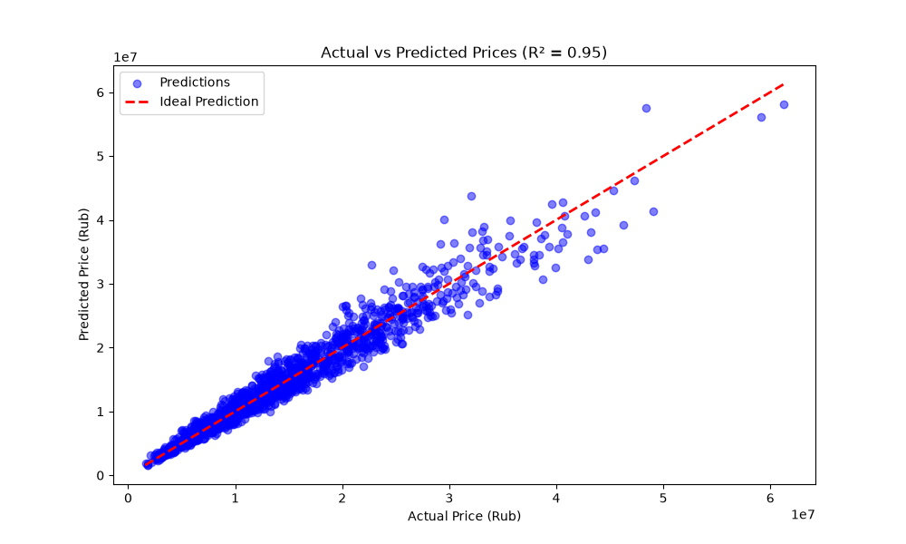

#  ML Housing Predictor (Moscow)

Сервис для предсказания стоимости недвижимости на основе машинного обучения. Проект демонстрирует полный цикл разработки ML-приложения: от сбора данных и Feature Engineering до деплоя модели через FastAPI и написания интеграционных тестов.

## Стек технологий
*   **Backend:** Python, FastAPI, Uvicorn
*   **ML & Data Science:** Scikit-learn, CatBoost, Pandas, NumPy, Joblib, pyTorch
*   **Testing:** Pytest, TestClient
*   **Visualization:** Matplotlib
*   **Containerization:** Docker

## Результаты модели
В ходе работы были протестированы несколько алгоритмов (LinearRegression, RandomForest, CatBoost). Лучший результат показал **CatBoost Regressor**:
*   **R² Score:** 0.952 (объясняет более 95% дисперсии цен)
*   **Ключевые признаки:** Площадь, район, застройщик, класс жилья, этаж.


## Установка и запуск

1.  Клонируйте репозиторий и создайте виртуальное окружение:
    ```bash
    git clone https://github.com/sinedfq/ml-housing-predictor.git
    cd ml-housing-predictor
    python -m venv venv
    source venv/bin/activate  # или venv\Scripts\activate для Windows
    pip install -r requirements.txt
    ```

2.  Обучите модель (генерирует файлы в папке `models/`):
    ```bash
    python src/train.py
    ```

    ```bash
    python srs/train_nn.py
    ```

3.  Запустите API сервер:
    ```bash
    uvicorn api.main:app --reload --port 8001
    ```

4.  Документация API (Swagger) доступна по адресу: `http://127.0.0.1:8001/docs`

## Запуск Docker

1. ``` bash
   docker compose build --no-cache
   ```
   
2. ```bash
   docker compose up
   ```

## Тестирование
Проект покрыт интеграционными тестами. Для запуска:
```bash
pytest tests/test_api.py -v
```
## Анализ данных
В процессе обучения строится график сравнения реальных и предсказанных цен (models/prediction_quality.png), что позволяет визуально оценить качество модели и выявить аномалии.


## Автор
Хухарев Денис (Denis Khukharev) <br>
Backend Developer | ML Enthusiast
